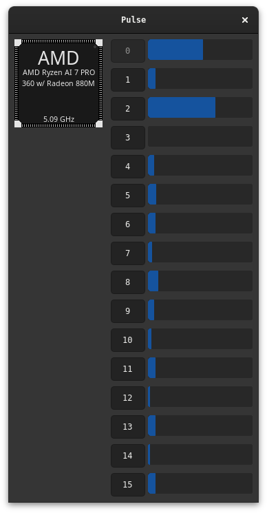

#+TITLE: Pulse: a port of the BeOS CPU usage meter

This repository contains my rust port of Pulse, rebuilt to use GTK4 and be
Wayland friendly. This is accomplished by spinning up a privileged helper
process and handling requests through IPC.

